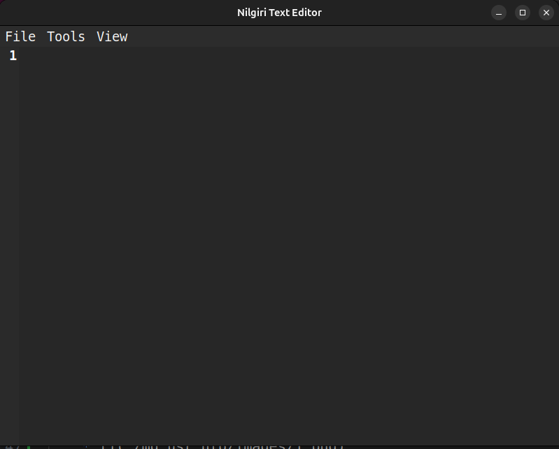
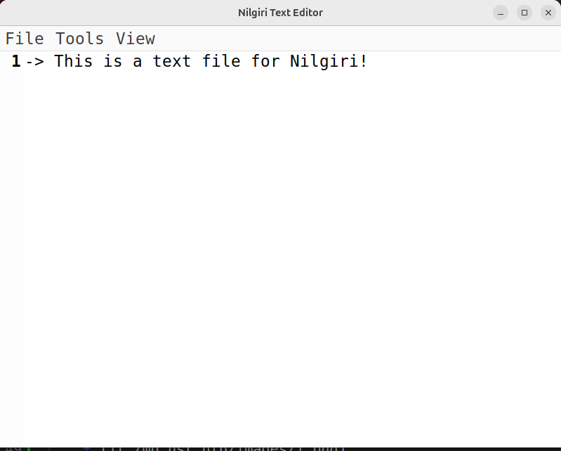
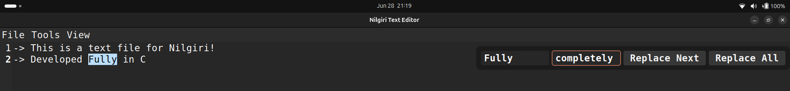
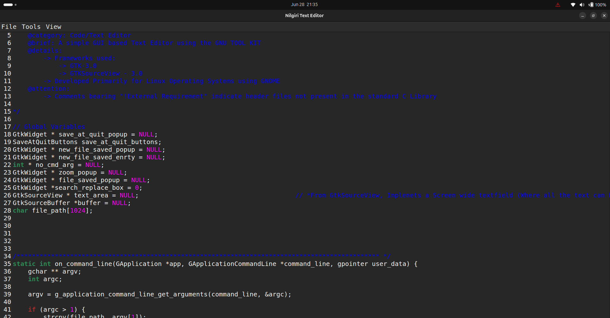

# Nilgiri Text Editor

A lightweight, cross-platform text and code editor built with GTK+ 3.0, designed for simplicity and efficiency.

## Table of Contents

- [Features](#features)
- [Screenshots](#screenshots)
- [Installation](#installation)
  - [Prerequisites](#prerequisites)
    - [Linux/Ubuntu](#linuxubuntu)
    - [macOS](#macos)
    - [Windows](#windows)
  - [Building from Source](#building-from-source)
- [Usage](#usage)
  - [Opening Files](#opening-files)
  - [Keyboard Shortcuts](#keyboard-shortcuts)
  - [Menu Options](#menu-options)
- [Technical Details](#technical-details)
  - [Built With](#built-with)
  - [Architecture](#architecture)
  - [System Requirements](#system-requirements)
- [Contributing](#contributing)
- [Development Notes](#development-notes)
- [Known Limitations](#known-limitations)
- [License](#license)
- [Support](#support)

---

## Features

- **Syntax Highlighting**: Automatic language detection and syntax highlighting for various programming languages
- **Search & Replace**: Powerful search and replace functionality with highlighting
- **Zoom Control**: Easy font size adjustment with visual feedback
- **Dark/Light Theme**: Toggle between themes with system preference support
- **Auto-indent**: Smart indentation for code editing
- **Line Numbers**: line numbering for easier navigation
- **Cross-platform**: Runs on Linux, macOS, and Windows

## Screenshots

| Feature | Preview |
|---------|---------|
| Main Interface |  |
| Light Theme |  |
| Search & Replace |  |
| Syntax Highlighting |  |

## Installation

### Prerequisites

#### Linux/Ubuntu
```bash
sudo apt install build-essential
sudo apt install libgtk-3-dev
sudo apt install libgtksourceview-3.0-dev
```

#### macOS
```bash
brew install gtk+3
brew install gtksourceview3
```

#### Windows
For Windows installation, please refer to the detailed guide in [Win_FrameWorks_hlp.md](./md_usr_hlp/Win_FrameWorks_hlp.md).

### Building from Source

1. Clone the repository:
```bash
git clone <repository-url>
cd Nilgiri-text-editor
```

2. Compile the editor:
```bash
make
```

3. Run the editor:
```bash
Nilgiri
```

## Usage

### Opening Files

**New File:**
```bash
Nilgiri
```

**Open Existing File:**
```bash
Nilgiri <filename>
```

**Command Line Examples:**
```bash
# Open a specific file
Nilgiri example.c

# Create a new file
Nilgiri newfile.txt
```

### Keyboard Shortcuts

| Action | Shortcut |
|--------|----------|
| **Zoom In** | `Ctrl` + `=` |
| **Zoom Out** | `Ctrl` + `-` |
| **Save File** | `Ctrl` + `S` |
| **Search & Replace** | `Ctrl` + `F` |
| **Toggle Syntax Highlighting** | `Ctrl` + `H` |
| **Toggle Theme** | `Ctrl` + `D` |
| **Quit Editor** | `Ctrl` + `Esc` |

### Menu Options

- **File Menu**: Save, Quit
- **Tools Menu**: Search & Replace functionality
- **View Menu**: Zoom controls

## Technical Details

### Built With
- **GTK+ 3.0**: Cross-platform GUI toolkit
- **GtkSourceView 3.0**: Text editing widget with syntax highlighting
- **C Programming Language**: Core implementation

### Architecture
The editor is structured with modular components:
- `main.c`: Application entry point and UI initialization
- `file_handling.c`: File I/O operations
- `fonts.c`: Font and zoom management
- `process.c`: Keyboard event handling
- `menu_bar.c`: Menu system implementation
- `overlays.c`: UI overlay management

### System Requirements
- GTK+ 3.0 or higher
- GtkSourceView 3.0 or higher
- GCC compiler (or compatible)

## Contributing

1. Fork the repository
2. Create your feature branch (`git checkout -b feature/AmazingFeature`)
3. Commit your changes (`git commit -m 'Add some AmazingFeature'`)
4. Push to the branch (`git push origin feature/AmazingFeature`)
5. Open a Pull Request

## Development Notes

- The editor uses GTK's native file dialogs and widgets
- Syntax highlighting is automatically detected based on file extension
- The application follows GTK+ design patterns and conventions
- CSS styling is loaded dynamically for theme support
- ❗ Note: The editor does not prompt to save on close via the window button — this is by design, inspired by minimalist tools like Vim. Use Ctrl + S or menu options to save manually. Closing using Ctrl + Esc does prompt to save before closing.

## Known Limitations

- Hard close (window X button) doesn't check for unsaved changes
- Windows compilation requires manual Makefile updates
- Theme toggle may not work if system is set to dark mode

## License

This project is licensed under the MIT License - see the [LICENSE](LICENSE) file for details.

## Support

For issues and questions:
1. Check the existing issues in the repository
2. Create a new issue with detailed description
3. Include your system information and steps to reproduce

---

**Note**: This is a student project demonstrating GTK+ application development. While functional, it may not include all features expected in production text editors.